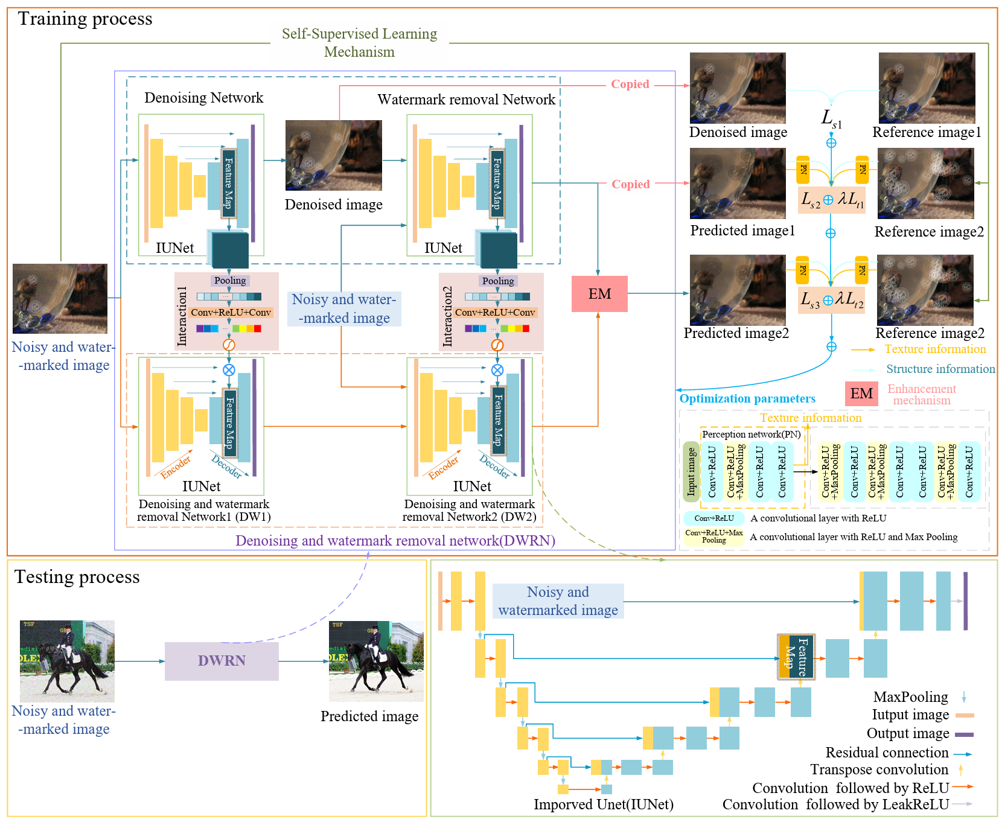
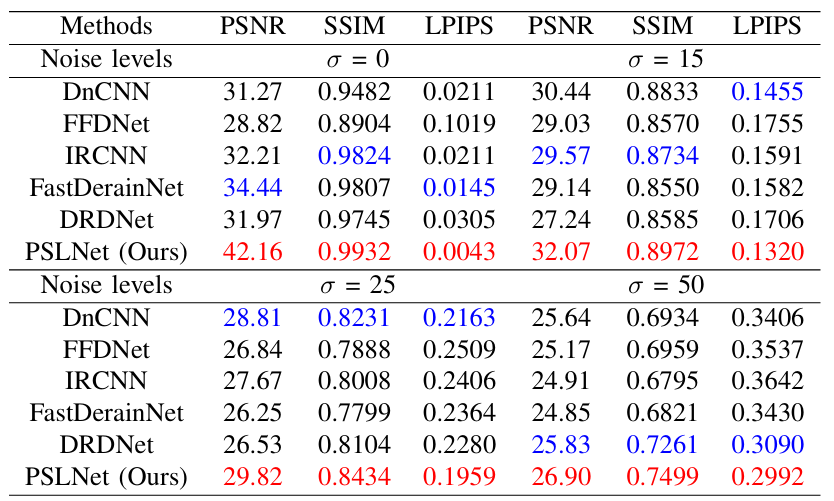
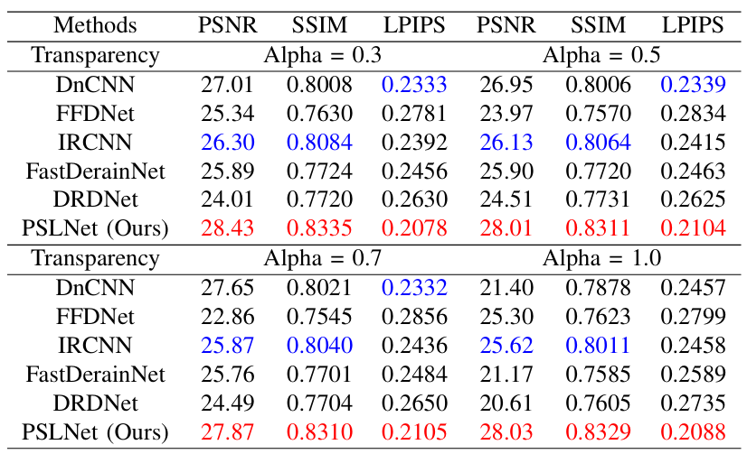
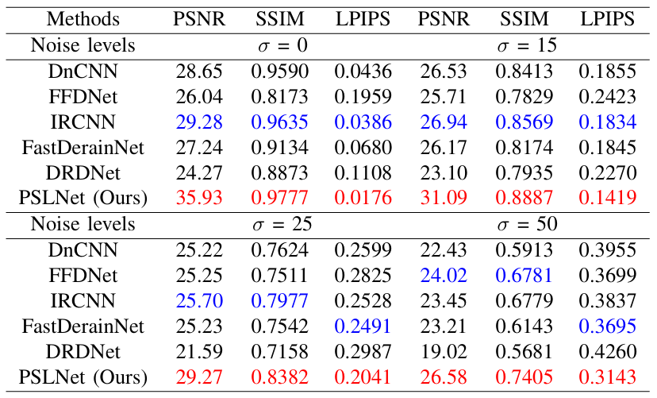
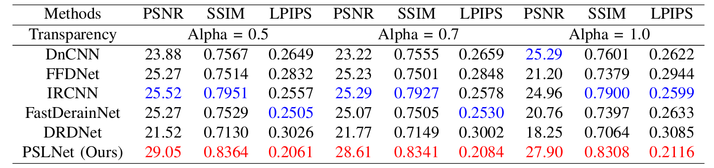
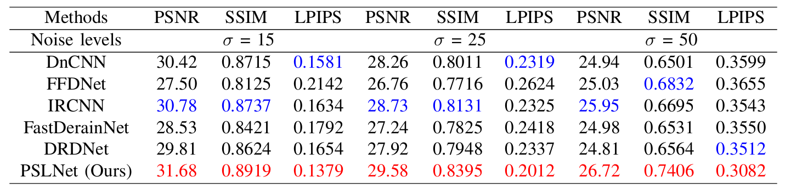
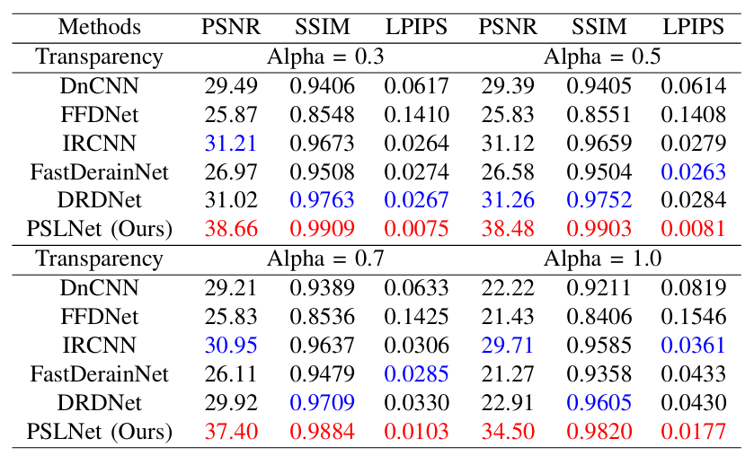
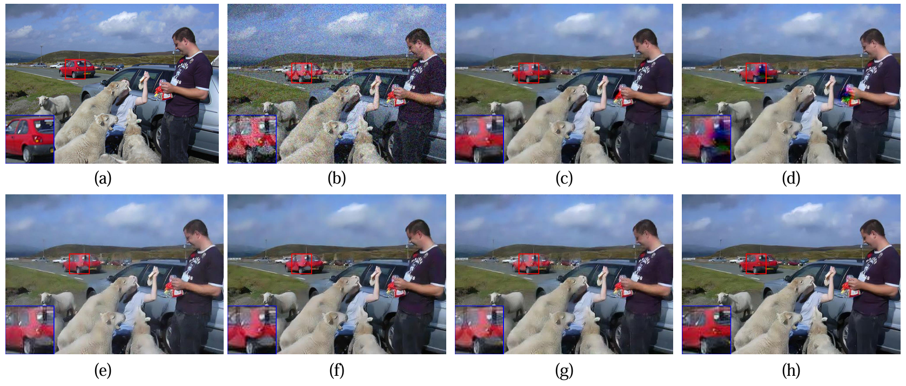
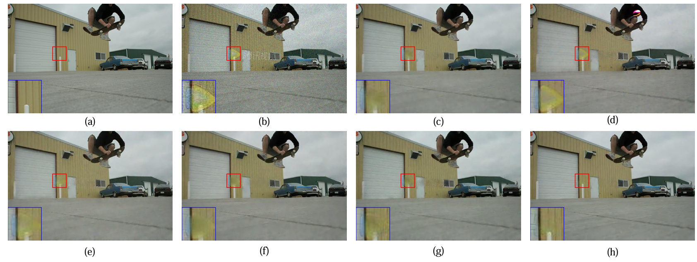

## This paper as well as  Perceptive self-supervised learning network for noisy image watermark removal is conducted by Chunwei Tian, Menghua Zheng, Bo Li, Yanning Zhang, Shichao Zhang, David Zhang. This  paper is accepted by the IEEE Transactions on Circuits and Systems for Video Technology (IF:8.4) and it is implemented by Pytorch. 

## This paper is reported by 52CV (https://mp.weixin.qq.com/s/aYcJCmQoUHUej7ahYKgWhw).
## Its original paper can be obtained at https://ieeexplore.ieee.org/abstract/document/10380632 or https://arxiv.org/html/2403.02211v1.

## Its abstract is shown as follows.

## Popular methods usually use a degradation model in a supervised way to learn a watermark removal model. However, it is true that reference images are difficult to obtain in the real world, as well as collected images by cameras suffer from noise. To overcome these drawbacks, we propose a perceptive self-supervised learning network for noisy image watermark removal (PSLNet) in this paper. PSLNet depends on a parallel network to remove noise and watermarks. The upper network uses task decomposition ideas to remove noise and watermarks in sequence. The lower network utilizes the degradation model idea to simultaneously remove noise and watermarks. Specifically, mentioned paired watermark images are obtained in a self supervised way, and paired noisy images (i.e., noisy and reference images) are obtained in a supervised way. To enhance the clarity of obtained images, interacting two sub-networks and fusing obtained clean images are used to improve the effects of image watermark removal in terms of structural information and pixel enhancement. Taking into texture information account, a mixed loss uses obtained images and features to achieve a robust model of noisy image watermark removal. Comprehensive experiments show that our proposed method is very effective in comparison with popular convolutional neural networks (CNNs) for noisy image watermark removal. Codes can be obtained at https://github.com/hellloxiaotian/PSLNet.

## Requirements (Pytorch)

* pytorch==1.11.0
* tensorboard==2.9.1
* scikit-image==0.19.3
* pyyaml==5.1
* h5py==3.7.0
* opencv-python==4.6.0
* matplotlib==3.5.2

## DataSet

### Training datasets

#### The training dataset of the PASCAL VOC 2021 can be obtained at https://pjreddie.com/projects/pascal-voc-dataset-mirror/

### Training datasets

#### The training dataset of the PASCAL VOV 2012 can be obtained at https://pan.baidu.com/s/1BiNUWJMVW6rnxsVATFpwBA (ygk5) or https://drive.google.com/drive/folders/1K8a9IYjHbXudMc8ldsnM9anLR8w4n-lT?usp=drive_link (Google drive)

## Command

Download model file at https://pan.baidu.com/s/1J6SvuXfH3I7oS_JYPJzM4w (passwd: 2biu) and put `data`/  into `PSLNet/`  or https://drive.google.com/drive/folders/1K8a9IYjHbXudMc8ldsnM9anLR8w4n-lT?usp=drive_link (Google drive)

### Test

python test_noisy.py --net PSLNet --mode [B/S] --mode_wm [B/S] --test_noiseL [0/15/25/50] --alphaL [0.3/0.5/0.7/1.0] --loss L1 --self_supervised True --display False

### Train

python train_noisy.py --net PSLNet --noiseL 25 --mode_wm S --alpha 0.3 --loss L1 --self_supervised True --display False

mode：trained with blind noise [B] or not [S]

mode_wm：trained with blind watermarks [B] or not [S]

test_noiseL：noise levels [0/15/25/50]

alphaL：watermark transparency[0.3/0.5/0.7/1.0] 

## 1. Network architecture of PSLNet.

## 2. Average PSNR(dB), SSIM and LPIPS of different methods for noise level of 0, 15, 25 and 50 with watermark transparency of 0.3.  

## 3. Average PSNR(dB), SSIM and LPIPS of different methods for noise level of 25 with watermark transparency of 0.3, 0.5, 0.7 and 1.0. 

## 4. Average PSNR(dB), SSIM and LPIPS of different methods for blind noise levels with watermark transparency of 0.3. 

## 5. Average PSNR (DB), SSIM, and LPIPS of different methods trained on blind noise level and blind watermark transparency and tested with the fixed noise level of 25 and certain watermark transparency of 0.5, 0.7, and 1.0.

## 6. Average PSNR(dB), SSIM and LPIPS of different methods trained with blind noise and without watermarks, and tested with certain noise levels of 15, 25, 50 without watermarks. 

## 

## 7. Average PSNR(dB), SSIM and LPIPS of different methods trained blind watermark transparency without noise and tested certain watermark transparency of 0.3, 0.5, 0.7 and 1.0 without noise.  

## 

### 8. Results of different methods on one image from test dataset when σ = 25 and transparency = 0.3.

### 9. Results of different methods on one image from test dataset when σ = 15 and transparency = 0.3. 

## You can cite this paper by the following ways.

### 1. Tian C, Zheng M, Li B, et al. Perceptive self-supervised learning network for noisy image watermark removal[J]. IEEE Transactions on Circuits and Systems for Video Technology, 2024.

### 2.@article{tian2024perceptive,
       title={Perceptive self-supervised learning network for noisy image watermark removal},
       author={Tian, Chunwei and Zheng, Menghua and Li, Bo and Zhang, Yanning and Zhang, Shichao and Zhang, David},
       journal={IEEE Transactions on Circuits and Systems for Video Technology},
      year={2024},
     publisher={IEEE}
}
